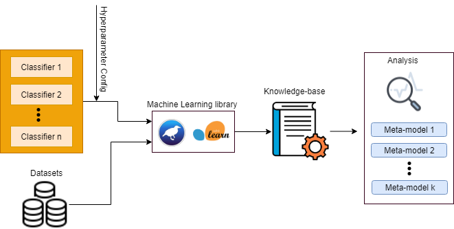

# AutoMLMetaLearn

In the context of Automated
Machine Learning (AutoML) process, one main advantage of
meta-learning techniques is that they allow replacing hand-engineered algorithms with novel automated methods which are
designed in a data-driven way. In this paper, we present a
methodology and framework for using Meta-Learning techniques
to develop new methods that serve as an effective multi-objective
decision support for the AutoML process. In particular, we use
Meta-Learning techniques to answer several crucial questions for
the AutoML process including: 

1) Which classifiers are expected to be the best performing on a given dataset? 

2) Can we predict the training time of a classifier? 

3) Which classifiers are worth investing a larger portion of the time budget attempting to improve their performance by tuning them? 

In our framework, we run N classifiers, each
classifier with K different hyper-parameters configurations,
over M datasets. The results of all runs are stored in a
knowledge base where each record represents one run of
a classifier c with hyper-parameter configurations h over a
dataset d. 

  

 

In this study, we used 200 datasets that have been col-
lected from the popular OpenML repository. The
datasets represent a mix of binary (54%) and multi-
class (46%) classification tasks. The sizes of the datasets
vary where the size of the largest among them is 350
MB.

We used 13 classifiers from the popular Python-based machine learning library, Scikit-learn. These classifiers are:
<pre> 
Gaussian Process       K Neighbors               SVC 

AdaBoost               Random Forest             Quadratic Discriminant Analysis 

GaussianNB             Gradient Boosting         Linear Discriminant Analysis

Decision Tree          ComplementNB              Perceptron

Logistic Regression </pre>

We used 17 classifiers from the popular Java-based machine learning library, Weka. These classifiers are: 

<pre>

K-star                  Naive Bayes               Random Forest

Hoeffding Tree          IBK                       Decision Table

Bagging                 PART                      SMO

Logic Boost             Simple Logistic           Logistic Regression

AdaBoostM1              REPTree                   Logistic Model Trees

OneR                    J48 </pre>
